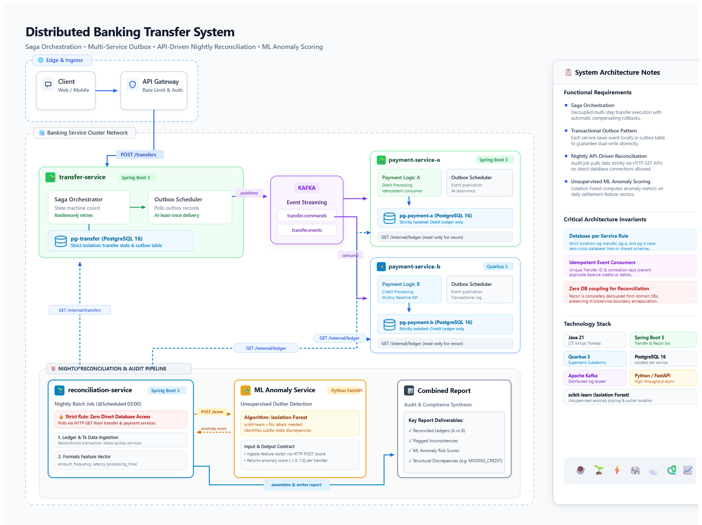
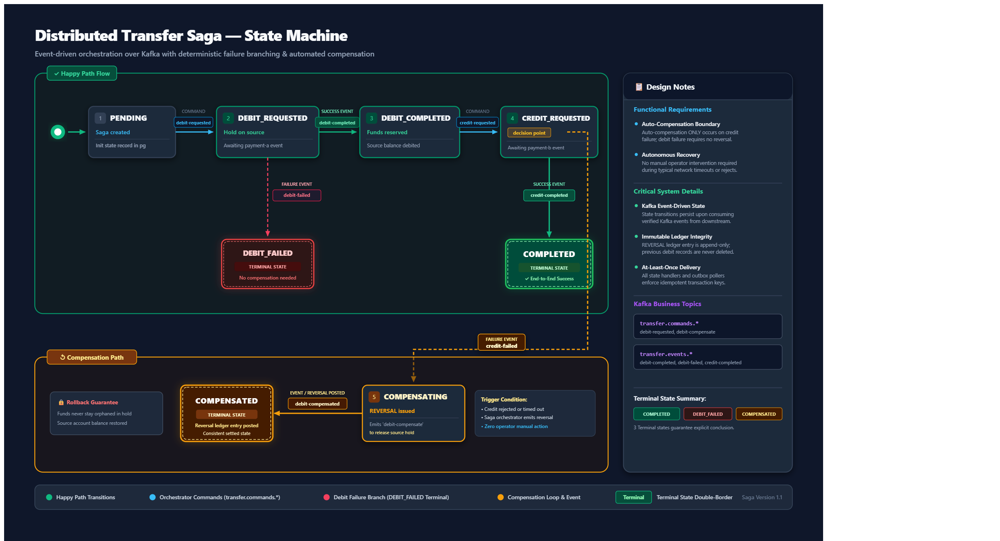
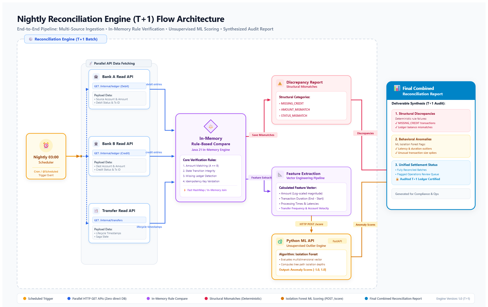
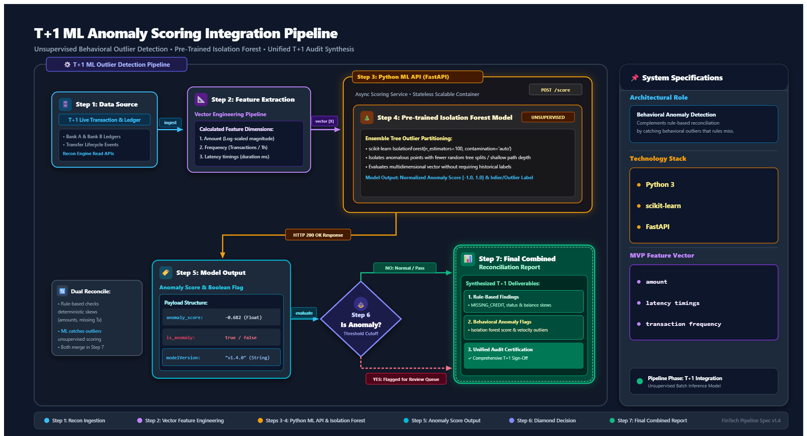

**🇬🇧 [English](#top-en) &nbsp;|&nbsp; 🇹🇷 [Türkçe](#top-tr)**

# 🏦 Fault-Tolerant Distributed Money Transfer System

> A distributed financial transaction prototype featuring Saga orchestration, transactional outbox over Kafka, T+1 automated reconciliation, and unsupervised ML anomaly detection.

 

[Architecture](#system-architecture) · [Features](#features) · [Database](#database) · [License](#license)

---

## 📖 About the Project
This project simulates a secure, fault-tolerant money transfer process between two distinct banking microservices. It implements the **Saga Pattern (Orchestration)** and **Transactional Outbox Pattern** over **Apache Kafka** to handle distributed transactions safely. Additionally, it introduces a **T+1 Automated Reconciliation Engine** integrated with an **Unsupervised Machine Learning (Isolation Forest)** layer to detect behavioral anomalies.

## ✨ Features
* **Distributed Transaction Management:** Centralized Saga Orchestrator handling multi-step transactions and automated compensating transactions (reversals).
* **Guaranteed Delivery:** Polling-based Transactional Outbox Pattern ensuring zero message loss.
* **T+1 Reconciliation:** Nightly batch job to synthesize ledger integrity with zero direct DB access.
* **Behavioral Anomaly Detection:** Scikit-learn based Isolation Forest model integrated seamlessly via FastAPI.

## 🛠️ Technology Stack
* **Backend:** Java 21, Spring Boot 3, Quarkus 3
* **Messaging:** Apache Kafka
* **Database:** PostgreSQL 16
* **Machine Learning:** Python, FastAPI, scikit-learn
* **Infrastructure:** Docker, Docker Compose

## 🏗️ System Architecture

| 🏛️ Core Architecture | 🔄 Saga State Machine |
|---|---|
|  |  |

| 🕵️ T+1 Reconciliation Flow | 🧠 ML Anomaly Pipeline |
|---|---|
|  |  |

## 🗄️ Database Architecture
Total strict isolation (**Database-per-Service**). 
1. `transfer_db`
2. `bank_a_db`
3. `bank_b_db`
4. `recon_db`

## 📄 License

MIT License

Copyright (c) 2026 Eray Yalman

Permission is hereby granted, free of charge, to any person obtaining a copy
of this software and associated documentation files (the "Software"), to deal
in the Software without restriction, including without limitation the rights
to use, copy, modify, merge, publish, distribute, sublicense, and/or sell
copies of the Software, and to permit persons to whom the Software is
furnished to do so, subject to the following conditions:

The above copyright notice and this permission notice shall be included in all
copies or substantial portions of the Software.

THE SOFTWARE IS PROVIDED "AS IS", WITHOUT WARRANTY OF ANY KIND, EXPRESS OR
IMPLIED, INCLUDING BUT NOT LIMITED TO THE WARRANTIES OF MERCHANTABILITY,
FITNESS FOR A PARTICULAR PURPOSE AND NONINFRINGEMENT. IN NO EVENT SHALL THE
AUTHORS OR COPYRIGHT HOLDERS BE LIABLE FOR ANY CLAIM, DAMAGES OR OTHER
LIABILITY, WHETHER IN AN ACTION OF CONTRACT, TORT OR OTHERWISE, ARISING FROM,
OUT OF OR IN CONNECTION WITH THE SOFTWARE OR THE USE OR OTHER DEALINGS IN THE
SOFTWARE.

---

**🇬🇧 [English](#top-en) &nbsp;|&nbsp; 🇹🇷 [Türkçe](#top-tr)**

# 🏦 Hata Toleranslı Dağıtık Para Transfer Sistemi

> Saga orkestrasyonu, Kafka üzerinden Outbox deseni, T+1 otomatik mutabakat ve gözetimsiz (unsupervised) ML anomali tespiti içeren dağıtık finansal işlem prototipi.

 

[Mimari](#sistem-mimarisi-tr) · [Özellikler](#ozellikler-tr) · [Veritabanı](#veritabani-tr) · [Lisans](#lisans-tr)

---

## 📖 Proje Hakkında
Bu proje, mikroservisler arasında güvenli ve hata toleranslı bir para transferi sürecini simüle eder. Dağıtık işlemleri güvenli bir şekilde yönetmek için **Apache Kafka** üzerinde **Saga Pattern (Orkestrasyon)** ve **Transactional Outbox Pattern** kullanır. Ayrıca, davranışsal anomalileri tespit etmek için **Gözetimsiz Makine Öğrenmesi (Isolation Forest)** katmanını entegre eden bir **T+1 Otomatik Mutabakat (Reconciliation) Motoru** barındırır.

## ✨ Özellikler
* **Dağıtık İşlem Yönetimi:** Transfer yaşam döngüsünü ve otomatik telafi (compensation) işlemlerini yöneten merkezi Saga Orkestratörü.
* **Güvenilir Mesajlaşma:** Sıfır veri kaybı sağlayan Outbox Pattern.
* **T+1 Mutabakat:** Doğrudan veritabanı erişimi olmadan (Zero Direct DB Access) API'ler üzerinden çalışan otomatik gece mutabakatı.
* **ML Anomali Tespiti:** FastAPI üzerinden entegre edilen scikit-learn tabanlı Isolation Forest modeli.

## 🛠️ Teknolojiler
* **Backend:** Java 21, Spring Boot 3, Quarkus 3
* **Mesajlaşma:** Apache Kafka
* **Veritabanı:** PostgreSQL 16
* **Makine Öğrenmesi:** Python, FastAPI, scikit-learn
* **Altyapı:** Docker, Docker Compose

## 🏗️ Sistem Mimari Çizimleri

| 🏛️ Ana Mimari | 🔄 Saga State Machine |
|---|---|
|  |  |

| 🕵️ T+1 Mutabakat (Reconciliation) | 🧠 ML Anomali Boru Hattı |
|---|---|
|  |  |

## 🗄️ Veritabanı Mimarisi
Tam katı izolasyon (**Database-per-Service**).
1. `transfer_db`
2. `bank_a_db`
3. `bank_b_db`
4. `recon_db`

## 📄 Lisans
Bu proje, yukarıda metni bulunan **MIT Lisansı** altında Eray Yalman (2026) tarafından lisanslanmıştır. İlgili haklar ve kısıtlamalar için İngilizce lisans metnini inceleyebilirsiniz.